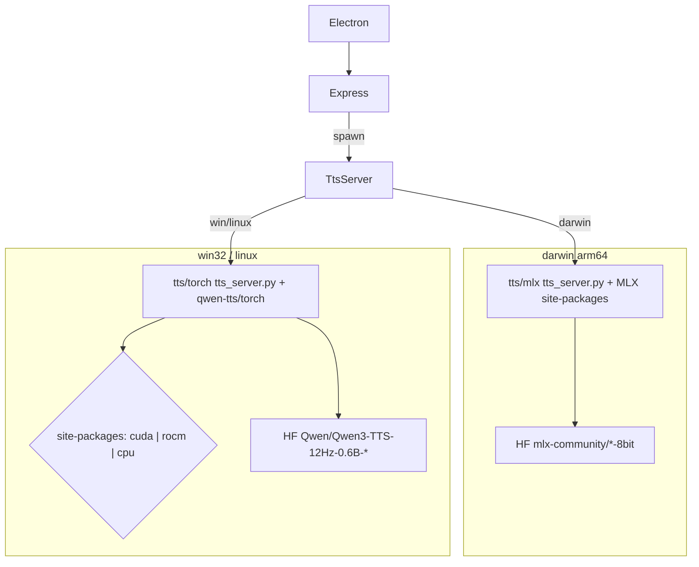

# Backends TTS por plataforma + empacotamento estrito

## Restrição real

- **macOS Apple Silicon:** continua com MLX em [`qwen3-tts-apple-silicon/`](../../qwen3-tts-apple-silicon/) (já funciona).
- **Windows / Linux:** MLX não roda. Novo backend com o pacote oficial [`qwen-tts`](https://github.com/QwenLM/Qwen3-TTS) + PyTorch, expondo **a mesma API** (`/health`, `/tts`, `/tts/cancel`, `/tts/unload`) que o Express já usa.
- **GPU no Win/Linux:** PyTorch com wheels distintos — **NVIDIA (CUDA)**, **AMD (ROCm/HIP)** ou **CPU**. Não dá para misturar CUDA e ROCm no mesmo `site-packages`.
- Builds nativos (site-packages com `torch`/`mlx`) **só podem ser gerados na plataforma alvo** (ou CI multi-OS + variantes de acelerador). No Mac dava para gerar `.exe`/AppImage do Electron, mas não um `torch` Windows/Linux válido.

## Arquitetura



## Matriz de runtime

| OS | Backend | Acelerador | Notas |
|---|---|---|---|
| darwin arm64 | MLX | Apple GPU | Build atual |
| win32 / linux | Torch + qwen-tts | NVIDIA CUDA | Index PyTorch CUDA |
| win32 / linux | Torch + qwen-tts | AMD ROCm (HIP) | Wheels ROCm (Linux + Windows oficial AMD); Python **3.12** obrigatório |
| win32 / linux | Torch + qwen-tts | CPU | Fallback; lento, mas válido |

**Hardware AMD esperado (ROCm):** Radeon RX 7000 (RDNA 3), RX 9000 (RDNA 4), AI PRO, e Ryzen AI APUs suportados pelo stack ROCm da época do build. Driver Adrenalin / ROCm atualizado é pré-requisito do usuário; o app não embute o driver.

## 1. Novo backend Torch (Win/Linux)

Criar [`tts/torch/`](../../tts/torch/):

- `tts_server.py` — FastAPI compatível com o contrato atual (mesmos campos JSON: `text`, `voice`, `instruct`, `temperature`, `language`, `refAudioPath`, `refText`, `skipIcl`, `jobId`).
- Implementação com `Qwen3TTSModel`:
  - CustomVoice / skipIcl → `generate_custom_voice(speaker=...)`
  - ICL com âncora → `generate_voice_clone(ref_audio=..., ref_text=...)`
- Requirements por acelerador (não um único `requirements.txt` genérico com torch fixo):
  - `requirements-base.txt` — `qwen-tts`, `fastapi`, `uvicorn`, `soundfile`, `numpy`
  - `requirements-cuda.txt` / `requirements-rocm.txt` / `requirements-cpu.txt` — pin de `torch` via índice certo:
    - **CUDA:** `https://download.pytorch.org/whl/cu12x` (versão alinhada ao qwen-tts)
    - **ROCm Linux:** index oficial PyTorch ROCm (`whl/rocm6.x` / o que o qwen-tts exigir)
    - **ROCm Windows:** wheels AMD (`repo.radeon.com/rocm/windows/...`, cp312) — documentar URL pinada no script de prepare
    - **CPU:** `https://download.pytorch.org/whl/cpu`
- Sem `flash_attn` no Windows/AMD (usar SDPA padrão).

### Seleção de device (runtime)

Em `tts_server.py`, resolver na ordem (override com `AURA_TTS_DEVICE=cuda|hip|cpu` se presente):

1. `torch.cuda.is_available()` → `"cuda"`  
   (builds ROCm reportam HIP como `cuda` em PyTorch — funciona para NVIDIA e AMD ROCm)
2. senão → `"cpu"`

Expor no `/health`: `device`, `accel` (`cuda` | `rocm` | `cpu`) e, se possível, nome da GPU (`torch.cuda.get_device_name(0)`).

### Env úteis para AMD (documentar; setar no spawn se `accel=rocm`)

Referência de community builds (ex. Qwen3-TTS-AMD) e docs ROCm Radeon:

- `MIOPEN_FIND_MODE=2`
- `TORCH_ROCM_AOTRITON_ENABLE_EXPERIMENTAL=1`
- opcional: `MIOPEN_GEMM_ENFORCE_BACKEND=hipblaslt` (performance; validar estabilidade)

Manter o MLX atual; opcionalmente mover/alias para `tts/mlx/` apontando para o código atual de [`qwen3-tts-apple-silicon/tts_server.py`](../../qwen3-tts-apple-silicon/tts_server.py) para organizar, sem quebrar caminhos existentes no Mac.

## 2. Seleção de backend no app Node

Em [`server.ts`](../../server.ts) / [`electron/main.cjs`](../../electron/main.cjs):

- Resolver TTS por `process.platform`:
  - `darwin` → `qwen3-tts-apple-silicon` (MLX) + `Python.framework`
  - `win32` / `linux` → `tts/torch` + Python embutido daquele OS + `site-packages` (já vindos com a variante cuda/rocm/cpu empacotada)
- Env comuns: `QWEN_TTS_MODELS_DIR`, `VOICE_PREVIEW_DIR`, `AURA_ROOT`, `AURA_DATA_DIR`.
- Em Win/Linux com build ROCm: passar as env AMD acima ao spawn do Python.

Não detectar vendor de GPU no Node para *escolher* site-packages em runtime (o pacote já traz um torch). A detecção GPU só afeta `device`/`cpu` fallback dentro do processo Python.

## 3. Modelos por plataforma ([`modelManager.ts`](../../modelManager.ts))

Tabela de download condicionada à plataforma (igual para CUDA e ROCm — mesmos pesos HF):

| Plataforma | Base | CustomVoice |
|---|---|---|
| darwin | `mlx-community/Qwen3-TTS-12Hz-0.6B-Base-8bit` | `mlx-community/...-CustomVoice-8bit` |
| win/linux | `Qwen/Qwen3-TTS-12Hz-0.6B-Base` | `Qwen/Qwen3-TTS-12Hz-0.6B-CustomVoice` |

Tokenizer oficial (`Qwen/Qwen3-TTS-Tokenizer-12Hz`) entra na lista Win/Linux se o load local exigir pasta separada; caso `from_pretrained` resolva sozinho a partir do model dir, não empacotar/duplicar.

UI de setup ([`src/ModelSetup.tsx`](../../src/ModelSetup.tsx)) permanece; só muda o que o status API lista. Opcional: mostrar `accel`/`device` vindos de `/health` no setup.

## 4. Prepare resources por OS + acelerador

Refatorar [`scripts/prepare-app-resources.cjs`](../../scripts/prepare-app-resources.cjs) para aceitar:

```text
--platform=darwin|win32|linux
--accel=cuda|rocm|cpu   # ignorado em darwin; default em win/linux: cuda
```

- **darwin:** comportamento atual (Python.framework + site-packages MLX + `tts_server.py` MLX; **sem** models).
- **win32 / linux:** embutir Python **3.12** portátil daquele OS + `pip install -r requirements-base.txt -r requirements-<accel>.txt` em `site-packages` + scripts Torch; **sem** MLX e **sem** models.
- Saída sempre em `build/app-resources/` (sobrescrita por plataforma/acelerador), consumida pelo `extraResources` → `aura/`.
- Gravar `build/app-resources/tts-accel.json` (`{ "platform", "accel" }`) para o app saber o que foi empacotado e setar env ROCm no spawn.

Não misturar site-packages MLX, CUDA e ROCm no mesmo pacote.

## 5. Empacotamento Electron

Em [`package.json`](../../package.json):

- `dist:mac` → prepare darwin + `electron-builder --mac --arm64` (icns)
- `dist:win` → prepare win32 `--accel=cuda` + `electron-builder --win --x64`
- `dist:win:rocm` → prepare win32 `--accel=rocm` + builder win
- `dist:win:cpu` → prepare win32 `--accel=cpu` + builder win
- `dist:linux` → prepare linux `--accel=cuda` + `electron-builder --linux AppImage|deb --x64`
- `dist:linux:rocm` → prepare linux `--accel=rocm` + builder linux
- `dist:linux:cpu` → prepare linux `--accel=cpu` + builder linux

Targets:

- Windows: `nsis` + `dir`
- Linux: `AppImage` (e/ou `deb`)

Paths no main: `python3.12` vs `python.exe`; site-packages paths Windows (`Lib/site-packages`) vs Unix.

Nome do artefato / canal de distribuição deve deixar claro o acelerador (`-cuda`, `-rocm`, `-cpu`) para o usuário AMD não instalar o build NVIDIA por engano.

## 6. O que NÃO entra em cada build

- Mac: sem Torch, sem CUDA/ROCm wheels, sem `tts/torch` pesado.
- Win/Linux CUDA: sem `mlx*`, sem wheels ROCm, sem `Python.framework`.
- Win/Linux ROCm: sem `mlx*`, sem wheels NVIDIA CUDA, sem `Python.framework`.
- Win/Linux CPU: sem CUDA/ROCm GPU libs.
- Todos: models continuam download na 1ª abertura (já implementado).

## 7. Validação

- Mac (esta máquina): `bun run dist:mac` + smoke UI/TTS MLX.
- Win/Linux NVIDIA: backend Torch + `dist:*` com `--accel=cuda` em VM/CI com GPU NVIDIA.
- Win/Linux AMD: backend Torch + `dist:*:rocm` em máquina com ROCm/Adrenalin; smoke `/health` reportando GPU AMD e `/tts` ok.
- CPU: smoke mínimo em CI sem GPU (timeouts generosos).
- Documentar pré-requisitos AMD (driver, Python 3.12 no prepare, GPUs suportadas) no README da pasta `tts/torch/`.
