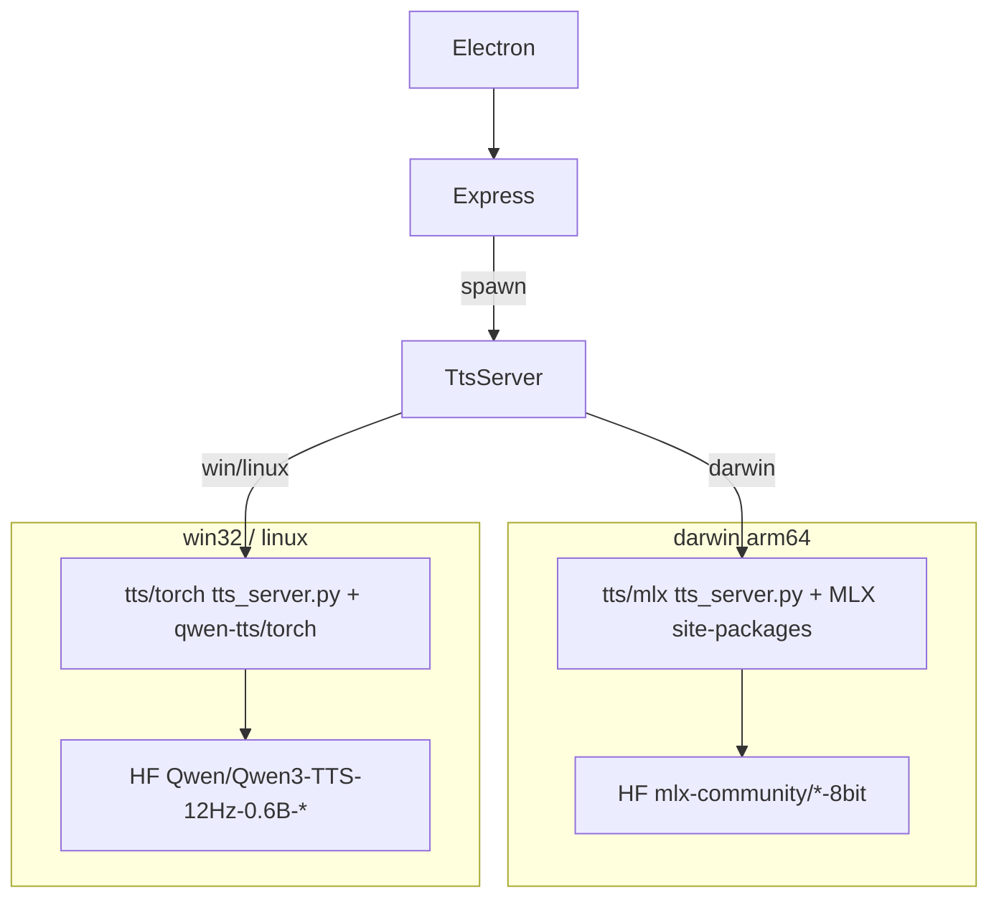

# Backends TTS por plataforma + empacotamento estrito

## Restrição real

- **macOS Apple Silicon:** continua com MLX em [`qwen3-tts-apple-silicon/`](../../qwen3-tts-apple-silicon/) (já funciona).
- **Windows / Linux:** MLX não roda. Novo backend com o pacote oficial [`qwen-tts`](https://github.com/QwenLM/Qwen3-TTS) + PyTorch, expondo **a mesma API** (`/health`, `/tts`, `/tts/cancel`, `/tts/unload`) que o Express já usa.
- Builds nativos (site-packages com `torch`/`mlx`) **só podem ser gerados na plataforma alvo** (ou CI multi-OS). No Mac dava para gerar `.exe`/AppImage do Electron, mas não um `torch` Windows válido.

## Arquitetura

## 1. Novo backend Torch (Win/Linux)

Criar [`tts/torch/`](../../tts/torch/):

- `tts_server.py` — FastAPI compatível com o contrato atual (mesmos campos JSON: `text`, `voice`, `instruct`, `temperature`, `language`, `refAudioPath`, `refText`, `skipIcl`, `jobId`).
- Implementação com `Qwen3TTSModel`:
  - CustomVoice / skipIcl → `generate_custom_voice(speaker=...)`
  - ICL com âncora → `generate_voice_clone(ref_audio=..., ref_text=...)`
- `requirements.txt` — `qwen-tts`, `fastapi`, `uvicorn`, `soundfile`, `numpy`, torch via index CUDA/CPU documentado.
- Device: `cuda` se disponível, senão `cpu` (funciona, mais lento). Sem `flash_attn` no Windows (SDPA padrão).

Manter o MLX atual; opcionalmente mover/alias para `tts/mlx/` apontando para o código atual de [`qwen3-tts-apple-silicon/tts_server.py`](../../qwen3-tts-apple-silicon/tts_server.py) para organizar, sem quebrar caminhos existentes no Mac.

## 2. Seleção de backend no app Node

Em [`server.ts`](../../server.ts) / [`electron/main.cjs`](../../electron/main.cjs):

- Resolver TTS por `process.platform`:
  - `darwin` → `qwen3-tts-apple-silicon` (MLX) + `Python.framework`
  - `win32` / `linux` → `tts/torch` + Python embutido daquele OS + `site-packages`
- Env comuns: `QWEN_TTS_MODELS_DIR`, `VOICE_PREVIEW_DIR`, `AURA_ROOT`, `AURA_DATA_DIR`.

## 3. Modelos por plataforma ([`modelManager.ts`](../../modelManager.ts))

Tabela de download condicionada à plataforma:

| Plataforma | Base | CustomVoice |
|---|---|---|
| darwin | `mlx-community/Qwen3-TTS-12Hz-0.6B-Base-8bit` | `mlx-community/...-CustomVoice-8bit` |
| win/linux | `Qwen/Qwen3-TTS-12Hz-0.6B-Base` | `Qwen/Qwen3-TTS-12Hz-0.6B-CustomVoice` |

Tokenizer oficial (`Qwen/Qwen3-TTS-Tokenizer-12Hz`) entra na lista Win/Linux se o load local exigir pasta separada; caso `from_pretrained` resolva sozinho a partir do model dir, não empacotar/duplicar.

UI de setup ([`src/ModelSetup.tsx`](../../src/ModelSetup.tsx)) permanece; só muda o que o status API lista.

## 4. Prepare resources por OS

Refatorar [`scripts/prepare-app-resources.cjs`](../../scripts/prepare-app-resources.cjs) para aceitar `--platform=darwin|win32|linux`:

- **darwin:** comportamento atual (Python.framework + site-packages MLX + `tts_server.py` MLX; **sem** models).
- **win32 / linux:** embutir Python portátil daquele OS + `pip install -r tts/torch/requirements.txt` em `site-packages` + scripts Torch; **sem** MLX e **sem** models.
- Saída sempre em `build/app-resources/` (sobrescrita por plataforma), consumida pelo `extraResources` → `aura/`.

Não misturar site-packages MLX e Torch no mesmo pacote.

## 5. Empacotamento Electron

Em [`package.json`](../../package.json):

- `dist:mac` → prepare darwin + `electron-builder --mac --arm64` (icns)
- `dist:win` → prepare win32 + `electron-builder --win --x64` (icon.png + `.ico` gerado a partir de [`assets/icon.png`](../../assets/icon.png))
- `dist:linux` → prepare linux + `electron-builder --linux AppImage|deb --x64`

Targets:

- Windows: `nsis` + `dir`
- Linux: `AppImage` (e/ou `deb`)

Paths no main: `python3.12` vs `python.exe`; site-packages paths Windows (`Lib/site-packages`) vs Unix.

## 6. O que NÃO entra em cada build

- Mac: sem Torch, sem CUDA wheels, sem `tts/torch` pesado.
- Win/Linux: sem `mlx*`, sem `Python.framework`, sem pasta MLX/`qwen3-tts-apple-silicon` além do necessário.
- Todos: models continuam download na 1ª abertura (já implementado).

## 7. Validação

- Mac (esta máquina): `bun run dist:mac` + smoke UI/TTS MLX.
- Win/Linux: preparar scripts + backend; build completo nativo documentado como passo em VM/CI da plataforma (não cross-compile de wheels).
